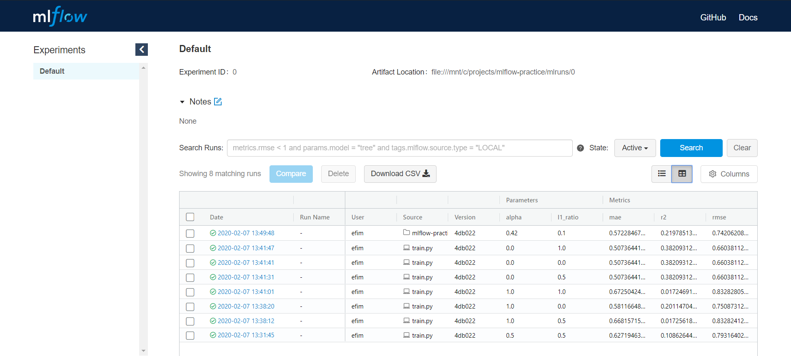
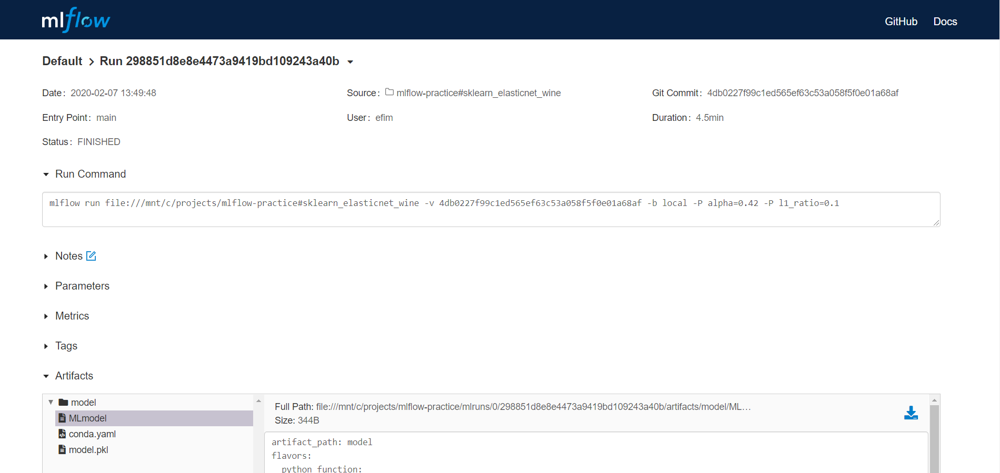
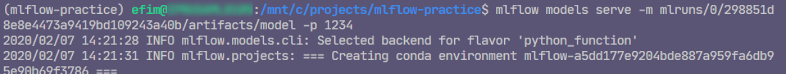
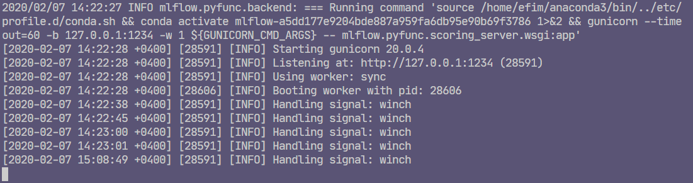
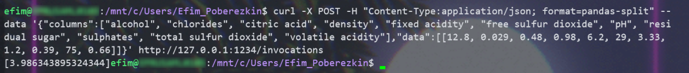

# MLflow Practice

## Following ["sklearn elasticnet wine" tutorial](https://mlflow.org/docs/latest/tutorials-and-examples/tutorial.html)

*\* In activated `conda` environment `mlflow-practice` (see environment.yml) with already installed `mlflow` and `sklearn`*

### Training the model and comparing experiments

```bash
$ python sklearn_elasticnet_wine/train.py
$ mlflow ui
$ python sklearn_elasticnet_wine/train.py 1 0.5
... # run more experiments, they appear on mlflow ui
```



### Packaging model

```bash
$ mlflow run sklearn_elasticnet_wine -P alpha=0.42
```



### Serving model

```bash
$ mlflow models serve -m mlruns/0/298851d8e8e4473a9419bd109243a40b/artifacts/model -p 1234
```



...



### Querying server

```bash
$ curl -X POST -H "Content-Type:application/json; format=pandas-split" --data '{"columns":["alcohol", "chlorides", "citric acid", "density", "fixed acidity", "free sulfur dioxide", "pH", "residual sugar", "sulphates", "total sulfur dioxide", "volatile acidity"],"data":[[12.8, 0.029, 0.48, 0.98, 6.2, 29, 3.33, 1.2, 0.39, 75, 0.66]]}' http://127.0.0.1:1234/invocations
```


